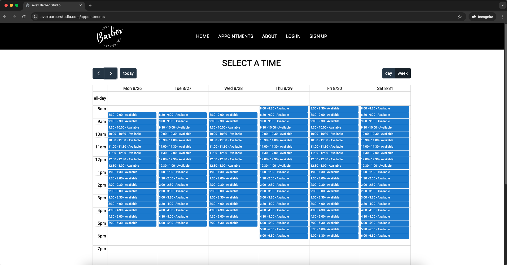

# Avex Barber Studio

Avex Barber Studio is a full-stack web application designed to streamline appointment booking and service management. Built using the MERN stack (MongoDB, Express.js, React.js, Node.js), this application offers a user-friendly interface for clients and barbers alike to manage bookings, view schedules, and explore the services provided by the barbershop.

Visit the live application at [AvexBarberStudio.com](https://www.avexbarberstudio.com).

## Features

### 1. Appointment Booking System
- **Interactive Calendar:** The application integrates with [FullCalendar.io](https://fullcalendar.io) to provide a dynamic calendar interface. Users can select their desired date and time directly from the calendar.
- **Service Selection:** Clients can choose from various services offered by the barbershop and book an appointment at their convenience.
- **Appointment Management:** Both clients and employees can view their booked appointments, allowing for easy schedule management.
  

### 2. Authentication and Authorization
- **User Authentication:** Secure user authentication is implemented using JSON Web Tokens (JWT) and bcrypt for password hashing.
- **Role-Based Access:** The application distinguishes between clients and employees, providing different levels of access and functionality based on the user’s role.

### 3. Image Gallery
- **Carousel Gallery:** The home page features an image carousel that showcases the barbershop owner's work, giving clients a visual preview of the services provided.
  

### 4. Responsive Design
- The application is designed to be fully responsive, providing a seamless experience across desktop, tablet, and mobile devices.

### 5. Deployment
- The application is deployed and hosted on Heroku, making it accessible to users at any time.

## Tech Stack

- **Frontend:** React.js, FullCalendar.io, Axios
- **Backend:** Node.js, Express.js
- **Database:** MongoDB (with Mongoose for data modeling)
- **Authentication:** JSON Web Tokens (JWT), bcrypt
- **Deployment:** Heroku
